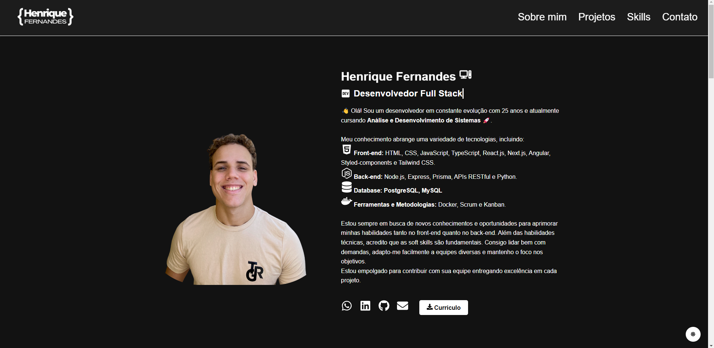

# Meu Portfólio de Desenvolvedor 💼

## Deploy: https://portfolio-fa3dw0kpy-henriquefernandesgouveiagmailcoms-projects.vercel.app/

Este é o repositório do meu portfólio de desenvolvedor, criado com [React](https://reactjs.org/) e [Vite](https://vitejs.dev/), com estilização feita com [styled-components](https://styled-components.com/). O projeto possui animações, ícones e um tema alternável entre modo claro e escuro para tornar a navegação mais agradável e personalizada.

## 🖥️ Visão Geral do Projeto

O objetivo deste portfólio é apresentar minhas habilidades como desenvolvedor e os projetos que já desenvolvi. As seções incluem:

- **Sobre Mim**: Foto, nome e título com animação de digitação, além de um breve texto sobre minha experiência.
- **Educação**: Formação acadêmica
- **Projetos**: Uma galeria interativa dos meus projetos, com imagens, descrições e links para o GitHub.
- **Contato**: Redes sociais e informações de contato.

## 🔧 Tecnologias Utilizadas

- **Frontend**: React com Vite
- **Estilização**: styled-components
- **Animações**: Framer Motion para transições suaves e efeitos
- **Tema Dark/Light**: Persistência no `localStorage` com gerenciamento através do `ThemeContext`

## 🚀 Funcionalidades

- Alternância entre temas claro e escuro.
- Grid para exibição dos projetos.
- Efeitos de animação nos títulos, fotos e seções.
- Header fixo com um menu de navegação para todas as seções.
  
## 📂 Estrutura do Projeto

```plaintext
/
├── public          # Imagens e logos
├── src
│   ├── components  # Componentes reutilizáveis (Header, Footer, etc.)
│   ├── pages       # Seções do portfólio (Sobre Mim, Projetos, etc.)
│   ├── styles      # Estilizações globais e temas
│   └── context     # Contexto para tema e alternância de modo
└── README.md       # Documentação do projeto
```

## 📝 Como Executar o Projeto

- Clone o repositório: git clone https://github.com/henriferi/portfolio.git
- Instale as dependências: npm install
- Execute o projeto: npm run dev
- Acesse em http://localhost:3000 para visualizar.


## 📸 Prévia do Projeto




## Autor: Henrique Fernandes 💻


Qualquer feedback ou sugestões são bem-vindos! 😊


